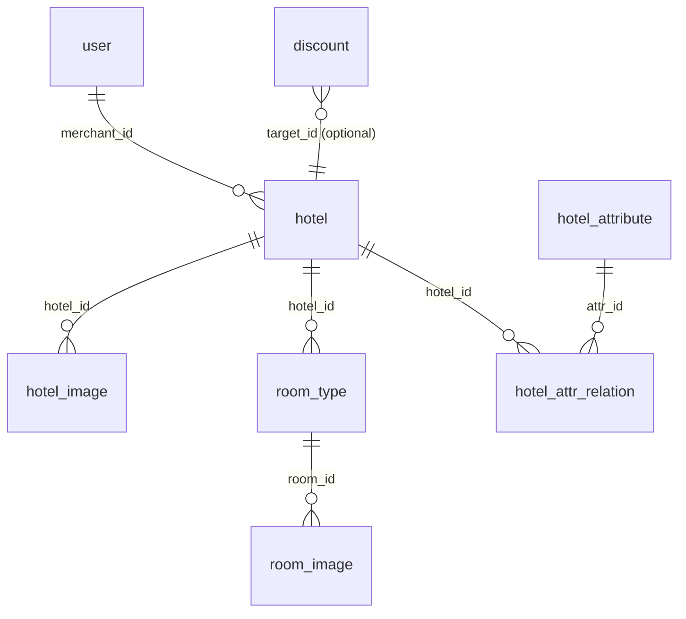

<!-- ========================================= -->
<!--         易宿酒店预订系统 README            -->
<!-- ========================================= -->

<a id="readme-top"></a>

<!-- Badges -->
<p align="center">
  
  
  
  
  
  
  
</p>

<!-- Logo + Title -->
<br />
<div align="center">
  <!-- TODO: 替换为项目 Logo 图片链接 -->
  <h1>🏨 易宿酒店预订系统</h1>
  <h3>YiSu Hotel Reservation System</h3>
  <p>基于 Spring Boot + React 的全栈酒店管理平台，覆盖商户酒店管理和管理员审核全流程。</p>
  <p>
    <a href="#getting-started">快速开始</a>
    ·
    <a href="#usage">使用方式</a>
    ·
    <a href="#project-structure">项目结构</a>
    ·
    <a href="#roadmap">路线图</a>
  </p>
</div>

---

<!-- TABLE OF CONTENTS -->
<details>
  <summary>📑 目录 / Table of Contents</summary>
  <ol>
    <li><a href="#about-the-project">About The Project（项目简介）</a></li>
    <li><a href="#built-with">Built With（技术栈）</a></li>
    <li>
      <a href="#getting-started">Getting Started（快速开始）</a>
      <ul>
        <li><a href="#prerequisites">Prerequisites（前置要求）</a></li>
        <li><a href="#backend-installation">后端安装</a></li>
        <li><a href="#frontend-installation">前端安装</a></li>
      </ul>
    </li>
    <li><a href="#usage">Usage（使用方式）</a></li>
    <li><a href="#project-structure">Project Structure（项目结构）</a></li>
    <li><a href="#database-design">Database Design（数据库设计）</a></li>
    <li><a href="#roadmap">Roadmap（路线图）</a></li>
    <li><a href="#contributing">Contributing（贡献指南）</a></li>
    <li><a href="#license">License</a></li>
    <li><a href="#contact">Contact</a></li>
  </ol>
</details>

---

## About The Project（项目简介）

<a id="about-the-project"></a>

**易宿酒店预订系统** 是一个面向酒店行业的 B 端全栈管理平台。系统提供两套管理视角：**商户端**可完成酒店信息录入、房型管理、图片上传与审核提交等操作；**管理员端**可进行酒店审核、用户管理、属性（设施/城市/星级）配置等系统级操作。

后端采用 **Spring Boot 3.2 + MyBatis-Plus** 架构，集成 Spring Security + JWT 实现身份认证和接口鉴权，数据库使用 **Supabase 托管的 PostgreSQL**，图片存储通过 OkHttp 对接 Supabase Storage API，实现了完整的云端数据管理链路。

前端管理后台基于 **React 19 + React Router 7 + Ant Design 6** 构建，使用 TailwindCSS 进行样式管理，Zustand 做全局状态管理，Vite 7 作为构建工具，支持 Docker 容器化部署。

<p align="right">(<a href="#readme-top">back to top</a>)</p>

---

## Built With（技术栈）

<a id="built-with"></a>

### 前端 - 管理后台 (Frontend - Admin/Merchant Dashboard)

| 技术                                                   | 版本     | 说明                    |
| ------------------------------------------------------ | -------- | ----------------------- |
| [React](https://react.dev/)                            | ^19.2.4  | UI 构建库               |
| [React Router](https://reactrouter.com/)               | 7.12.0   | 路由框架（含 SSR 支持） |
| [Ant Design](https://ant.design/)                      | ^6.2.2   | 企业级 UI 组件库        |
| [Ant Design Icons](https://ant.design/components/icon) | ^6.1.0   | 图标库                  |
| [Zustand](https://zustand-demo.pmnd.rs/)               | ^5.0.11  | 轻量级状态管理          |
| [Axios](https://axios-http.com/)                       | ^1.13.4  | HTTP 请求库             |
| [TailwindCSS](https://tailwindcss.com/)                | ^4.1.13  | 原子化 CSS 框架         |
| [Vite](https://vite.dev/)                              | ^7.1.7   | 构建工具                |
| [Lucide React](https://lucide.dev/)                    | ^0.563.0 | 补充图标库              |

### 后端 (Backend)

| 技术                                                          | 版本    | 说明                         |
| ------------------------------------------------------------- | ------- | ---------------------------- |
| [Spring Boot](https://spring.io/projects/spring-boot)         | 3.2.0   | 应用框架                     |
| [Spring Security](https://spring.io/projects/spring-security) | -       | 身份认证与授权               |
| [MyBatis-Plus](https://baomidou.com/)                         | 3.5.7   | ORM 持久层框架               |
| [JJWT](https://github.com/jwtk/jjwt)                          | 0.12.6  | JWT 令牌生成与校验           |
| [Lombok](https://projectlombok.org/)                          | 1.18.30 | 注解简化代码                 |
| [OkHttp](https://square.github.io/okhttp/)                    | 4.12.0  | Supabase Storage HTTP 客户端 |
| [Smart-Doc](https://smart-doc-group.github.io/)               | 3.0.5   | API 文档自动生成             |
| Java                                                          | 17      | JDK 版本                     |

### 数据库 & 存储 (Database & Storage)

| 技术                              | 说明                                            |
| --------------------------------- | ----------------------------------------------- |
| [Supabase](https://supabase.com/) | 云端 PostgreSQL 数据库托管                      |
| PostgreSQL                        | 关系型数据库引擎                                |
| Supabase Storage                  | 酒店/房型图片对象存储（Bucket: `hotel-assets`） |

<p align="right">(<a href="#readme-top">back to top</a>)</p>

---

## Getting Started（快速开始）

<a id="getting-started"></a>

### Prerequisites（前置要求）

<a id="prerequisites"></a>

- **Java** 17+（JDK）
- **Maven** 3.8+
- **Node.js** 18+ & **npm** 9+
- **Supabase 账号**：[注册地址](https://supabase.com/)，需创建项目并在 SQL Editor 中执行建表脚本

```bash
# 检查环境
java -version   # >= 17
mvn -v           # >= 3.8
node -v          # >= 18
```

---

### 后端安装 (Backend)

<a id="backend-installation"></a>

```bash
# 1. 进入后端目录
cd YiSuSystem

# 2. 配置数据库连接
#    编辑 src/main/resources/application.properties（或 application.yml）
#    填入你的 Supabase PostgreSQL 连接信息：
#    - spring.datasource.url=jdbc:postgresql://<host>:5432/postgres
#    - spring.datasource.username=postgres
#    - spring.datasource.password=<your-password>

# 3. 编译并启动
mvn spring-boot:run
```

服务启动后默认监听 **http://localhost:8080**。

> [!CAUTION]
> Supabase Storage 的访问凭据（URL 和 Key）需在配置文件中正确设置。切勿将 `service_role` Key 提交到代码仓库！

---

### 前端安装 (Frontend)

<a id="frontend-installation"></a>

```bash
# 1. 进入前端目录
cd Front

# 2. 安装依赖
npm install

# 3. 启动开发模式
npm run dev
```

启动后访问终端中显示的地址（通常为 **http://localhost:5173**）即可进入管理后台。

> [!IMPORTANT]
> 前端需要后端服务同时运行才能正常获取数据。请确认 `Front/app/api/` 中的 API 基地址与后端实际地址匹配。

<p align="right">(<a href="#readme-top">back to top</a>)</p>

---

## Usage（使用方式）

<a id="usage"></a>

### 主要 API 端点

#### 用户模块

| 方法   | 端点                | 说明                       |
| ------ | ------------------- | -------------------------- |
| `POST` | `/user/login`       | 用户登录（返回 JWT Token） |
| `POST` | `/user/register`    | 用户注册                   |
| `GET`  | `/user/list`        | 管理员获取用户列表         |
| `GET`  | `/user/profile`     | 获取当前用户信息           |
| `PUT`  | `/user/profile`     | 修改个人信息               |
| `PUT`  | `/user/status/{id}` | 切换用户状态               |

#### 酒店模块

| 方法   | 端点                        | 说明                   |
| ------ | --------------------------- | ---------------------- |
| `GET`  | `/hotel/merchant/list`      | 商户获取自己的酒店列表 |
| `GET`  | `/hotel/{id}`               | 获取酒店详情           |
| `POST` | `/hotel`                    | 新建酒店               |
| `PUT`  | `/hotel/{id}`               | 编辑酒店               |
| `PUT`  | `/hotel/{id}/online-status` | 上/下线酒店            |
| `POST` | `/hotel/{id}/submit-audit`  | 商户提交审核           |
| `GET`  | `/hotel/audit/list`         | 管理员获取待审核列表   |
| `PUT`  | `/hotel/audit/approve/{id}` | 审核通过               |
| `PUT`  | `/hotel/audit/reject/{id}`  | 审核驳回               |

#### 房型 & 图片模块

| 方法     | 端点                         | 说明             |
| -------- | ---------------------------- | ---------------- |
| `GET`    | `/hotel/{id}/rooms`          | 获取酒店房型列表 |
| `POST`   | `/hotel/{id}/rooms`          | 新建房型         |
| `PUT`    | `/hotel/{id}/rooms/{roomId}` | 编辑房型         |
| `DELETE` | `/hotel/{id}/rooms/{roomId}` | 删除房型         |
| `GET`    | `/hotel/{id}/images`         | 获取酒店图片列表 |

#### 属性管理模块

| 方法                  | 端点                   | 说明     |
| --------------------- | ---------------------- | -------- |
| `GET/POST/PUT/DELETE` | `/property/facilities` | 设施管理 |
| `GET/POST/PUT/DELETE` | `/property/cities`     | 城市管理 |
| `GET/POST/PUT/DELETE` | `/property/starLevels` | 星级管理 |

### Docker 部署（前端）

```bash
cd Front
docker build -t yisu-front .
docker run -p 3000:3000 yisu-front
```

<p align="right">(<a href="#readme-top">back to top</a>)</p>

---

## Project Structure（项目结构）

<a id="project-structure"></a>

```
YiSuHotelReservationSystem/
├── Front/                           # 前端管理后台 (React + Vite)
│   ├── app/
│   │   ├── api/
│   │   │   └── base/                # API 请求封装
│   │   │       ├── hotelApi.js      #   酒店 API
│   │   │       ├── hotelImageApi.js #   酒店图片 API
│   │   │       ├── roomTypeApi.js   #   房型 API
│   │   │       └── roomImageApi.js  #   房型图片 API
│   │   ├── components/              # 可复用组件
│   │   │   ├── admin/               #   管理员专用组件
│   │   │   └── merchant/            #   商户专用组件
│   │   ├── views/                   # 页面视图
│   │   │   ├── admin/               #   管理员页面（审核、用户管理等）
│   │   │   ├── merchant/            #   商户页面（酒店管理、房型管理等）
│   │   │   └── base/                #   通用页面（登录、注册）
│   │   ├── store/                   # Zustand 状态管理
│   │   ├── routes/                  # 路由配置
│   │   ├── utils/                   # 工具函数
│   │   ├── routes.js                # 路由定义
│   │   └── root.jsx                 # 应用根组件
│   ├── public/                      # 静态资源
│   ├── Dockerfile                   # Docker 构建配置
│   ├── vite.config.js               # Vite 构建配置
│   └── package.json
│
├── YiSuSystem/                      # 后端项目 (Spring Boot + MyBatis-Plus)
│   ├── src/main/java/com/yisusystem/
│   │   ├── YiSuSystemApplication.java  # 启动类
│   │   ├── controller/              # RESTful 控制器
│   │   │   ├── UserController.java
│   │   │   ├── HotelController.java
│   │   │   ├── RoomTypeController.java
│   │   │   ├── HotelImageController.java
│   │   │   ├── RoomImageController.java
│   │   │   ├── HotelAttributeController.java
│   │   │   └── HotelAttrRelationController.java
│   │   ├── service/                 # 业务逻辑层
│   │   ├── mapper/                  # MyBatis-Plus Mapper 接口
│   │   ├── pojo/                    # 实体类 / DTO / VO
│   │   ├── config/                  # 配置类（Security、Supabase 等）
│   │   ├── filter/                  # JWT 过滤器
│   │   ├── handler/                 # 类型处理器
│   │   ├── common/                  # 公共工具（Result 封装等）
│   │   └── utils/                   # 工具类（JWT 等）
│   ├── src/main/resources/          # 配置文件
│   └── pom.xml                      # Maven 项目配置
│
├── 数据库设计-2.md                    # 数据库表结构文档
└── hardcoded_data_audit.md           # 前端接口对接审计报告
```

<p align="right">(<a href="#readme-top">back to top</a>)</p>

---

## Database Design（数据库设计）

<a id="database-design"></a>

系统共设计 **8 张核心数据表**，完整字段定义见 [`数据库设计-2.md`](./数据库设计-2.md)。

| #   | 表名                  | 说明                    |
| --- | --------------------- | ----------------------- |
| 1   | `user`                | 用户表（商户 / 管理员） |
| 2   | `hotel`               | 酒店信息表              |
| 3   | `hotel_attribute`     | 酒店属性标签表          |
| 4   | `hotel_attr_relation` | 酒店-属性多对多关联表   |
| 5   | `hotel_image`         | 酒店轮播图表            |
| 6   | `room_type`           | 房型表                  |
| 7   | `room_image`          | 房型图片表              |
| 8   | `discount`            | 优惠规则表（可选）      |



<p align="right">(<a href="#readme-top">back to top</a>)</p>

---

## Roadmap（路线图）

<a id="roadmap"></a>

- [x] 用户注册 / 登录（JWT + Spring Security 鉴权）
- [x] 商户酒店 CRUD（新建、编辑、上下线）
- [x] 房型 CRUD + 图片管理（Supabase Storage）
- [x] 管理员酒店审核流程（通过 / 驳回）
- [x] 酒店属性（设施）标签管理
- [x] Smart-Doc API 文档自动生成
- [x] Docker 容器化部署（前端）
- [ ] 前端 Mock 数据全面替换为真实 API 对接（详见 [`hardcoded_data_audit.md`](./hardcoded_data_audit.md)）
- [ ] 管理员 Dashboard 统计面板
- [ ] 商户酒店统计接口
- [ ] 城市 / 星级属性管理接口
- [ ] TODO: 订单管理模块
- [ ] TODO: C 端用户 APP 集成

<p align="right">(<a href="#readme-top">back to top</a>)</p>

---

## Contributing（贡献指南）

<a id="contributing"></a>

本项目使用 **Supabase 共享云数据库** 进行多人协作：

1. **Fork** 本仓库并 Clone 到本地。
2. 创建你的 Feature 分支：`git checkout -b feature/AmazingFeature`
3. **获取数据库访问权限**：
   - 联系项目管理员，获取 Supabase 的 PostgreSQL 连接字符串。
   - 在 `src/main/resources/` 中配置你的数据库连接信息。
4. 如有数据库结构变动，请将 SQL 变更脚本同步给团队成员。
5. Commit 你的更改：`git commit -m 'feat: add AmazingFeature'`
6. Push 到你的分支：`git push origin feature/AmazingFeature`
7. 提交 **Pull Request**。

> [!WARNING]
> 数据库凭据和 Supabase Key 属于敏感信息，请通过安全渠道传递，切勿提交到代码仓库。确保 `application.properties` 或 `.env` 已被 `.gitignore` 排除。

<p align="right">(<a href="#readme-top">back to top</a>)</p>

---

## License

Distributed under the **MIT License**. See `LICENSE` for more information.

<!-- TODO: 创建 LICENSE 文件 -->

<p align="right">(<a href="#readme-top">back to top</a>)</p>

---

## Contact

<!-- TODO: 填写联系方式 -->

- 项目负责人：TODO
- Email：TODO
- 项目链接：TODO

<p align="right">(<a href="#readme-top">back to top</a>)</p>
