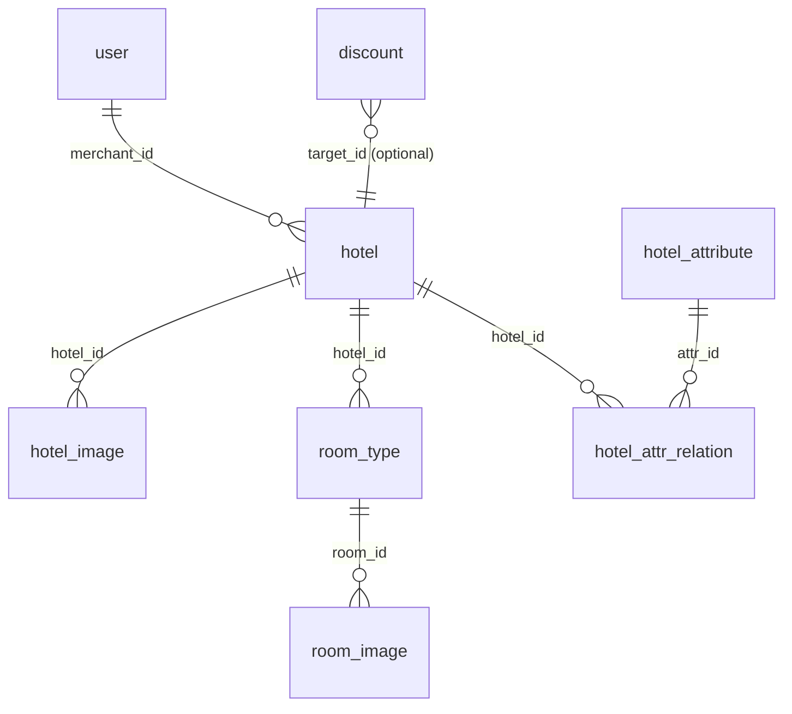

<!-- ========================================= -->

<!--         易宿酒店预订系统 README            -->

<!-- ========================================= -->

`<a id="readme-top"></a>`

<!-- Badges -->

<p align="center">
  
  
  
  
  
  
  
</p>

<!-- Logo + Title -->

<br />
<div align="center">
  <!-- TODO: 替换为项目 Logo 图片链接 -->
  <h1>🏨 易宿酒店预订系统</h1>
  <h3>YiSu Hotel Reservation System</h3>
  <p>
    全栈酒店预订 + 管理平台 —— C 端跨端 APP（H5 / 微信小程序 / Android）+ B 端管理后台 + Java 后端服务
  </p>
  <p>
    <a href="#getting-started">快速开始</a>
    ·
    <a href="#usage">使用方式</a>
    ·
    <a href="#project-structure">项目结构</a>
    ·
    <a href="#roadmap">路线图</a>
  </p>
</div>

---

<!-- TABLE OF CONTENTS -->

<details>
  <summary>📑 目录 / Table of Contents</summary>
  <ol>
    <li><a href="#about-the-project">About The Project（项目简介）</a></li>
    <li><a href="#built-with">Built With（技术栈）</a></li>
    <li>
      <a href="#getting-started">Getting Started（快速开始）</a>
      <ul>
        <li><a href="#prerequisites">Prerequisites（前置要求）</a></li>
        <li><a href="#backend-installation">后端安装 (YiSuSystem)</a></li>
        <li><a href="#frontend-app-installation">C 端 APP 安装 (hotel-app-v4)</a></li>
        <li><a href="#frontend-admin-installation">B 端管理后台安装 (Front)</a></li>
      </ul>
    </li>
    <li><a href="#usage">Usage（使用方式）</a></li>
    <li><a href="#project-structure">Project Structure（项目结构）</a></li>
    <li><a href="#database-design">Database Design（数据库设计）</a></li>
    <li><a href="#roadmap">Roadmap（路线图）</a></li>
    <li><a href="#contributing">Contributing（贡献指南）</a></li>
    <li><a href="#license">License</a></li>
    <li><a href="#contact">Contact</a></li>
  </ol>
</details>

---

## About The Project（项目简介）

`<a id="about-the-project"></a>`

**易宿酒店预订系统** 是一个面向酒店行业的全栈解决方案，包含三大子系统：

- **C 端用户 APP (`hotel-app-v4`)**：面向普通用户的酒店在线预订平台。用户可通过城市搜索、标签筛选、星级过滤快速找到心仪酒店，查看房型详情并完成预订。支持收藏、点评、消息通知和订单管理等功能。基于 **Taro 4 + React 18** 构建，一套代码同时运行于 H5、微信小程序与 Android。
- **B 端管理后台 (`Front`)**：面向商户和管理员的 Web 管理平台。商户可完成酒店信息录入、房型管理、图片上传与审核提交；管理员可进行酒店审核、用户管理、属性配置等系统级操作。基于 **React 19 + Ant Design 6 + React Router 7** 构建，使用 TailwindCSS + Vite 7 + Docker 部署。
- **Java 后端服务 (`YiSuSystem`)**：采用 **Spring Boot 3.2 + MyBatis-Plus** 架构，集成 Spring Security + JWT 实现身份认证和接口鉴权。数据库使用 **Supabase 托管的 PostgreSQL**，图片存储通过 OkHttp 对接 Supabase Storage API，实现完整的云端数据管理链路。

<p align="right">(<a href="#readme-top">back to top</a>)</p>

---

## Built With（技术栈）

`<a id="built-with"></a>`

### C 端 APP - 用户端 (hotel-app-v4)

| 技术                                           | 版本    | 说明                                      |
| ---------------------------------------------- | ------- | ----------------------------------------- |
| [Taro](https://taro-docs.jd.com/)                 | 4.1.11  | 跨端开发框架（H5 / 微信小程序 / Android） |
| [React](https://react.dev/)                       | ^18.0.0 | UI 构建库                                 |
| [Taroify](https://taroify.github.io/taroify.com/) | ^0.9.0  | UI 组件库（有赞 Vant Taro 版）            |
| [Zustand](https://zustand-demo.pmnd.rs/)          | ^4.5.0  | 轻量级状态管理                            |
| SCSS                                           | -       | 样式预处理器                              |
| Webpack 5                                      | ^5.91.0 | 构建工具                                  |
| [Capacitor](https://capacitorjs.com/)             | ^8.0.2  | Web → Android 原生壳                     |

### B 端管理后台 (Front)

| 技术                                  | 版本    | 说明                    |
| ------------------------------------- | ------- | ----------------------- |
| [React](https://react.dev/)              | ^19.2.4 | UI 构建库               |
| [React Router](https://reactrouter.com/) | 7.12.0  | 路由框架（含 SSR 支持） |
| [Ant Design](https://ant.design/)        | ^6.2.2  | 企业级 UI 组件库        |
| [Zustand](https://zustand-demo.pmnd.rs/) | ^5.0.11 | 轻量级状态管理          |
| [Axios](https://axios-http.com/)         | ^1.13.4 | HTTP 请求库             |
| [TailwindCSS](https://tailwindcss.com/)  | ^4.1.13 | 原子化 CSS 框架         |
| [Vite](https://vite.dev/)                | ^7.1.7  | 构建工具                |

### 后端 (YiSuSystem)

| 技术                                                       | 版本    | 说明                         |
| ---------------------------------------------------------- | ------- | ---------------------------- |
| [Spring Boot](https://spring.io/projects/spring-boot)         | 3.2.0   | 应用框架                     |
| [Spring Security](https://spring.io/projects/spring-security) | -       | 身份认证与授权               |
| [MyBatis-Plus](https://baomidou.com/)                         | 3.5.7   | ORM 持久层框架               |
| [JJWT](https://github.com/jwtk/jjwt)                          | 0.12.6  | JWT 令牌生成与校验           |
| [Lombok](https://projectlombok.org/)                          | 1.18.30 | 注解简化代码                 |
| [OkHttp](https://square.github.io/okhttp/)                    | 4.12.0  | Supabase Storage HTTP 客户端 |
| [Smart-Doc](https://smart-doc-group.github.io/)               | 3.0.5   | API 文档自动生成             |
| Java                                                       | 17      | JDK 版本                     |

### 数据库 & 存储 (Database & Storage)

| 技术                           | 说明                                               |
| ------------------------------ | -------------------------------------------------- |
| [Supabase](https://supabase.com/) | 云端 PostgreSQL 数据库托管 + RLS 权限控制          |
| PostgreSQL                     | 关系型数据库引擎                                   |
| Supabase Storage               | 酒店 / 房型图片对象存储（Bucket:`hotel-assets`） |

<p align="right">(<a href="#readme-top">back to top</a>)</p>

---

## Getting Started（快速开始）

`<a id="getting-started"></a>`

### Prerequisites（前置要求）

`<a id="prerequisites"></a>`

- **Java** 17+（JDK）
- **Maven** 3.8+
- **Node.js** 16+（hotel-app-v4）/ 18+（Front）& **npm** 8+
- **Supabase 账号**：[注册地址](https://supabase.com/)，需创建项目并在 SQL Editor 中执行建表脚本
- **微信开发者工具**（如需小程序调试）：[下载链接](https://developers.weixin.qq.com/miniprogram/dev/devtools/download.html)
- **Android Studio**（如需 Android 端调试）：需要 API 34+ 的模拟器镜像

```bash
# 检查环境
java -version   # >= 17
mvn -v           # >= 3.8
node -v          # >= 16 / 18
npm -v           # >= 8
```

---

### 后端安装 - YiSuSystem (Backend)

`<a id="backend-installation"></a>`

```bash
# 1. 进入后端目录
cd YiSuSystem

# 2. 配置数据库连接
#    编辑 src/main/resources/application.properties（或 application.yml）
#    填入你的 Supabase PostgreSQL 连接信息：
#    - spring.datasource.url=jdbc:postgresql://<host>:5432/postgres
#    - spring.datasource.username=postgres
#    - spring.datasource.password=<your-password>

# 3. 编译并启动
mvn spring-boot:run
```

服务启动后默认监听 **http://localhost:8080**。

> [!CAUTION]
> Supabase Storage 的访问凭据（URL 和 Key）需在配置文件中正确设置。切勿将 `service_role` Key 提交到代码仓库！

---

### C 端 APP 安装 - hotel-app-v4 (User App)

`<a id="frontend-app-installation"></a>`

```bash
# 1. 进入 C 端前端目录
cd hotel-app-v4

# 2. 安装依赖
npm install

# 3. 启动 H5 开发模式
npm run dev:h5
```

启动后访问 **http://localhost:10086/** 即可预览。

> [!WARNING]
> Android 模拟器需使用 **API 34+** 镜像，低版本 WebView 内核不支持新版 JS 语法会导致白屏。

---

### B 端管理后台安装 - Front (Admin Dashboard)

`<a id="frontend-admin-installation"></a>`

```bash
# 1. 进入管理后台前端目录
cd Front

# 2. 安装依赖
npm install

# 3. 启动开发模式
npm run dev
```

启动后访问终端中显示的地址（通常为 **http://localhost:5173**）即可进入管理后台。

> [!IMPORTANT]
> 两个前端均需要后端服务（YiSuSystem）同时运行才能正常获取数据。请确认各前端 API 基地址与后端实际地址匹配。

<p align="right">(<a href="#readme-top">back to top</a>)</p>

---

## Usage（使用方式）

`<a id="usage"></a>`

### 主要 API 端点（后端 YiSuSystem 提供）

#### 用户模块

| 方法     | 端点                  | 说明                       |
| -------- | --------------------- | -------------------------- |
| `POST` | `/user/login`       | 用户登录（返回 JWT Token） |
| `POST` | `/user/register`    | 用户注册                   |
| `GET`  | `/user/list`        | 管理员获取用户列表         |
| `GET`  | `/user/profile`     | 获取当前用户信息           |
| `PUT`  | `/user/profile`     | 修改个人信息               |
| `PUT`  | `/user/status/{id}` | 切换用户状态               |

#### 酒店模块

| 方法     | 端点                          | 说明                   |
| -------- | ----------------------------- | ---------------------- |
| `GET`  | `/hotel/merchant/list`      | 商户获取自己的酒店列表 |
| `GET`  | `/hotel/{id}`               | 获取酒店详情           |
| `POST` | `/hotel`                    | 新建酒店               |
| `PUT`  | `/hotel/{id}`               | 编辑酒店               |
| `PUT`  | `/hotel/{id}/online-status` | 上/下线酒店            |
| `POST` | `/hotel/{id}/submit-audit`  | 商户提交审核           |
| `GET`  | `/hotel/audit/list`         | 管理员获取待审核列表   |
| `PUT`  | `/hotel/audit/approve/{id}` | 审核通过               |
| `PUT`  | `/hotel/audit/reject/{id}`  | 审核驳回               |

#### 房型 & 图片模块

| 方法       | 端点                           | 说明             |
| ---------- | ------------------------------ | ---------------- |
| `GET`    | `/hotel/{id}/rooms`          | 获取酒店房型列表 |
| `POST`   | `/hotel/{id}/rooms`          | 新建房型         |
| `PUT`    | `/hotel/{id}/rooms/{roomId}` | 编辑房型         |
| `DELETE` | `/hotel/{id}/rooms/{roomId}` | 删除房型         |
| `GET`    | `/hotel/{id}/images`         | 获取酒店图片列表 |

#### 属性管理模块

| 方法                    | 端点                     | 说明     |
| ----------------------- | ------------------------ | -------- |
| `GET/POST/PUT/DELETE` | `/property/facilities` | 设施管理 |
| `GET/POST/PUT/DELETE` | `/property/cities`     | 城市管理 |
| `GET/POST/PUT/DELETE` | `/property/starLevels` | 星级管理 |

---

### C 端 APP 多端运行方式

```bash
# H5 网页版
npm run dev:h5          # 开发模式 → http://localhost:10086/

# 微信小程序
npm run dev:weapp       # 构建产物 → dist/
# 然后在微信开发者工具中导入 dist/ 目录

# Android App
npm run build:h5        # 构建 Web 资源
npx cap sync android    # 同步到 Android 工程
npx cap open android    # 打开 Android Studio → Run
```

### B 端管理后台 Docker 部署

```bash
cd Front
docker build -t yisu-front .
docker run -p 3000:3000 yisu-front
```

<p align="right">(<a href="#readme-top">back to top</a>)</p>

---

## Project Structure（项目结构）

`<a id="project-structure"></a>`

```
YiSuHotelReservationSystem/
│
├── hotel-app-v4/                    # C 端跨端 APP (Taro + React 18)
│   ├── src/
│   │   ├── app.jsx                  # 应用入口
│   │   ├── app.config.js            # 路由与页面配置
│   │   ├── config.js                # API 地址配置（多端适配）
│   │   ├── assets/                  # 静态资源（Tab 图标等）
│   │   ├── components/              # 可复用组件
│   │   │   ├── CustomTabBar/        #   自定义底部导航栏
│   │   │   ├── PageFadeIn/          #   页面进场动画
│   │   │   └── HotelCard.jsx        #   酒店卡片
│   │   ├── pages/                   # 页面目录
│   │   │   ├── home/                #   首页
│   │   │   ├── user/                #   个人中心
│   │   │   ├── order/               #   订单
│   │   │   ├── auth/                #   登录 / 注册
│   │   │   ├── hotel/               #   酒店列表 / 详情 / 预订（分包）
│   │   │   ├── sub-main/            #   收藏 / 消息 / 点评（分包）
│   │   │   └── sub-user/            #   常用入住人 / 设置（分包）
│   │   ├── services/                # API 请求封装
│   │   ├── store/                   # Zustand 全局状态
│   │   └── utils/                   # 工具函数
│   ├── android/                     # Android 原生工程 (Capacitor)
│   └── package.json
│
├── Front/                           # B 端管理后台 (React 19 + Vite + Ant Design)
│   ├── app/
│   │   ├── api/base/                # API 请求封装
│   │   │   ├── hotelApi.js          #   酒店 API
│   │   │   ├── hotelImageApi.js     #   酒店图片 API
│   │   │   ├── roomTypeApi.js       #   房型 API
│   │   │   └── roomImageApi.js      #   房型图片 API
│   │   ├── components/              # 可复用组件
│   │   │   ├── admin/               #   管理员专用组件
│   │   │   └── merchant/            #   商户专用组件
│   │   ├── views/                   # 页面视图
│   │   │   ├── admin/               #   管理员页面（审核、用户管理等）
│   │   │   ├── merchant/            #   商户页面（酒店管理、房型管理等）
│   │   │   └── base/                #   通用页面（登录、注册）
│   │   ├── store/                   # Zustand 状态管理
│   │   ├── routes/                  # 路由配置
│   │   └── root.jsx                 # 应用根组件
│   ├── Dockerfile                   # Docker 构建配置
│   └── package.json
│
├── YiSuSystem/                      # Java 后端 (Spring Boot 3.2 + MyBatis-Plus)
│   ├── src/main/java/com/yisusystem/
│   │   ├── YiSuSystemApplication.java  # 启动类
│   │   ├── controller/              # RESTful 控制器
│   │   │   ├── UserController.java
│   │   │   ├── HotelController.java
│   │   │   ├── RoomTypeController.java
│   │   │   ├── HotelImageController.java
│   │   │   ├── RoomImageController.java
│   │   │   ├── HotelAttributeController.java
│   │   │   └── HotelAttrRelationController.java
│   │   ├── service/                 # 业务逻辑层
│   │   ├── mapper/                  # MyBatis-Plus Mapper 接口
│   │   ├── pojo/                    # 实体类 / DTO / VO
│   │   ├── config/                  # 配置类（Security、Supabase 等）
│   │   ├── filter/                  # JWT 过滤器
│   │   ├── handler/                 # 类型处理器
│   │   ├── common/                  # 公共工具（Result 封装等）
│   │   └── utils/                   # 工具类（JWT 等）
│   ├── src/main/resources/          # 配置文件
│   └── pom.xml                      # Maven 项目配置
│
├── 数据库设计-2.md                    # 数据库表结构文档
└── hardcoded_data_audit.md           # 前端接口对接审计报告
```

<p align="right">(<a href="#readme-top">back to top</a>)</p>

---

## Database Design（数据库设计）

`<a id="database-design"></a>`

系统共设计 **8 张核心数据表**，完整字段定义见 [`数据库设计-2.md`](./数据库设计-2.md)。

| # | 表名                    | 说明                    |
| - | ----------------------- | ----------------------- |
| 1 | `user`                | 用户表（商户 / 管理员） |
| 2 | `hotel`               | 酒店信息表              |
| 3 | `hotel_attribute`     | 酒店属性标签表          |
| 4 | `hotel_attr_relation` | 酒店-属性多对多关联表   |
| 5 | `hotel_image`         | 酒店轮播图表            |
| 6 | `room_type`           | 房型表                  |
| 7 | `room_image`          | 房型图片表              |
| 8 | `discount`            | 优惠规则表（可选）      |



<p align="right">(<a href="#readme-top">back to top</a>)</p>

---

## Roadmap（路线图）

`<a id="roadmap"></a>`

### ✅ 已完成

- [X] 用户注册 / 登录（JWT + Spring Security 鉴权，角色区分：customer / merchant / admin）
- [X] 商户酒店 CRUD（新建、编辑、上下线、提交审核）
- [X] 管理员酒店审核流程（通过 / 驳回）
- [X] 房型 CRUD + 图片管理（Supabase Storage）
- [X] 酒店属性（设施）标签管理
- [X] C 端酒店列表 + 城市搜索 + 动态筛选 + 星级过滤
- [X] C 端酒店详情页 + 房型查询
- [X] C 端个人中心（订单管理、资料编辑、收藏、消息）
- [X] C 端 Android App 打包（Capacitor）
- [X] C 端页面进场动画 & 自定义 TabBar
- [X] Smart-Doc API 文档自动生成
- [X] B 端 Docker 容器化部署

### ([back to top](#readme-top))

---

## Contributing（贡献指南）

`<a id="contributing"></a>`

本项目使用 **Supabase 共享云数据库** 进行多人协作：

1. **Fork** 本仓库并 Clone 到本地。
2. 创建你的 Feature 分支：`git checkout -b feature/AmazingFeature`
3. **获取数据库访问权限**：
   - 联系项目管理员，获取 Supabase 的 PostgreSQL 连接字符串。
   - 后端：在 `YiSuSystem/src/main/resources/` 中配置数据库连接信息。
   - C 端：在 `hotel-app-v4/src/config.js` 中配置 API 基地址。
   - B 端：在 `Front/app/api/` 中确认 API 基地址。
4. 如有数据库结构变动，请将 SQL 变更脚本同步给团队成员。
5. Commit 你的更改：`git commit -m 'feat: add AmazingFeature'`
6. Push 到你的分支：`git push origin feature/AmazingFeature`
7. 提交 **Pull Request**。

> [!WARNING]
> 数据库凭据和 Supabase Key 属于敏感信息，请通过安全渠道传递，切勿提交到代码仓库。确保 `application.properties`、`.env` 等配置文件已被 `.gitignore` 排除。

<p align="right">(<a href="#readme-top">back to top</a>)</p>

---

## License

Distributed under the **MIT License**. See `LICENSE` for more information.

<!-- TODO: 创建 LICENSE 文件 -->

<p align="right">(<a href="#readme-top">back to top</a>)</p>

---

## Contact

<!-- TODO: 填写联系方式 -->

- 项目负责人：TODO
- Email：TODO
- 项目链接：TODO

<p align="right">(<a href="#readme-top">back to top</a>)</p>
